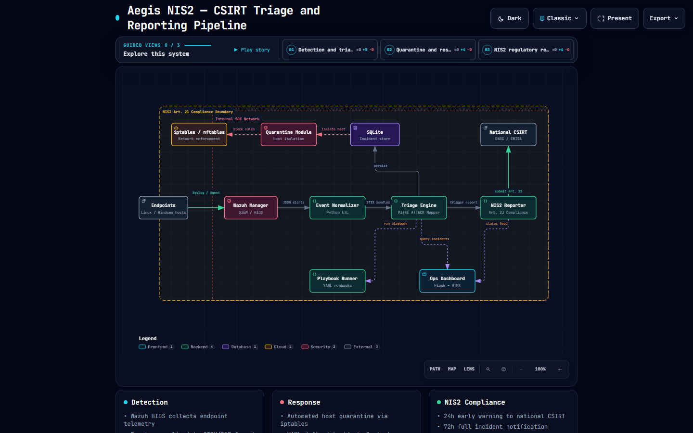
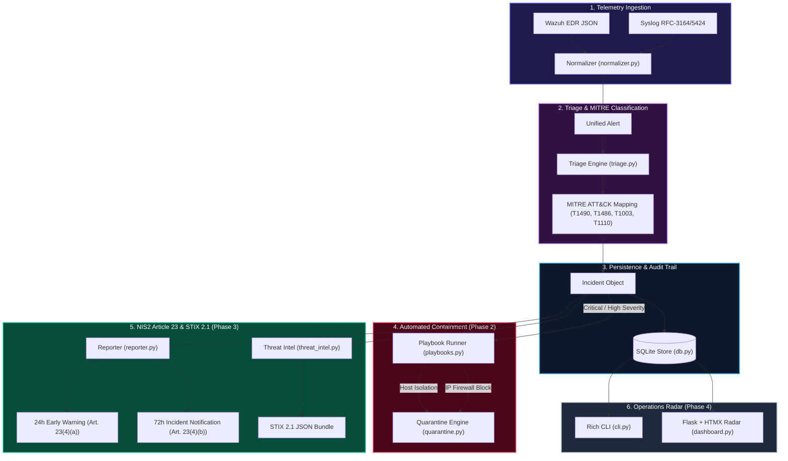

# Aegis NIS2 🛡️
### Autonomous Incident Triage, Automated Containment & EU NIS2 Regulatory Compliance Engine

[](https://github.com/DanielX8/aegis-nis2/actions)
[](https://www.python.org/downloads/)
[](https://opensource.org/licenses/MIT)
[-indigo.svg)](https://eur-lex.europa.eu/eli/dir/2022/2555/oj)
[](https://attack.mitre.org/)
[](https://oasis-open.github.io/cti-documentation/stix/intro)

---

## ⚡ Overview

**Aegis NIS2** is an enterprise-grade Security Orchestration, Automation, and Response (**SOAR**) framework engineered to solve two critical challenges facing modern Security Operations Centers (SOCs):

1. **Alert Fatigue**: Ingests, deduplicates, and normalizes high-volume telemetry from SIEMs (Wazuh, Syslog) and maps attacker behavior directly to the **MITRE ATT&CK®** matrix.
2. **Regulatory Non-Compliance**: Autonomously enforces the strict statutory incident response mandates of **EU Directive 2022/2555 (NIS2)**, calculating compliance clocks and generating regulator-ready notifications within the mandatory **24-hour Early Warning** window.

---

## 🏗️ System Architecture

[](https://danielx8.github.io/aegis-nis2/)

<p align="center">
  <a href="https://danielx8.github.io/aegis-nis2/">
    
  </a>
</p>



## 🚀 Key Features
- 🎯 **Automated Telemetry Normalization**: Parses nested Wazuh JSON and RFC-3164/5424 Syslog streams into structured Pydantic v2 domain models.
- ⏱️ **NIS2 Article 23 Compliance Radar**: Autonomously tracks statutory deadlines:
  - **24-Hour Early Warning** (Art. 23(4)(a))
  - **72-Hour Incident Notification** (Art. 23(4)(b))
  - **1-Month Final Incident Report** (Art. 23(4)(c))
- 🛑 **Automated Containment & Quarantine**: Host network isolation and edge firewall blocking via declarative YAML playbooks, with built-in critical asset safety guards and 1-click rollbacks.
- 📡 **STIX 2.1 Threat Sharing**: Exports incident IoCs and attack patterns to OASIS STIX 2.1 JSON for automated sharing with national CSIRTs and MISP.
- 🖥️ **Live Operations Dashboard & Rich CLI**: Flask + Tailwind + HTMX web radar with real-time countdown clocks and interactive CLI terminal tooling.

---

## 📊 MITRE ATT&CK® Technique Mapping

| MITRE ID | Technique Name | Detection Pattern | Default Severity | NIS2 Reportable? |
|---|---|---|---|:---:|
| **T1490** | Inhibit System Recovery | Shadow copy deletion / `vssadmin` sabotage | **CRITICAL** | ✅ YES |
| **T1486** | Data Encrypted for Impact | Ransomware payloads / `.locked` extensions | **CRITICAL** | ✅ YES |
| **T1048** | Exfiltration Over Alt Protocol | High-volume external uploads / S3 sync | **CRITICAL** | ✅ YES |
| **T1003** | OS Credential Dumping | LSASS memory scraping / Mimikatz activity | **HIGH** | ✅ YES |
| **T1059.001** | PowerShell Scripting | DownloadString / Encoded execution | **HIGH** | ✅ YES |
| **T1110** | Brute Force | Repeated SSH / RDP authentication failures | **HIGH** | ✅ YES |
| **T1046** | Network Service Discovery | Port scanning / Nmap sweeps | **LOW** | ❌ NO |

---

## 🛠️ Quickstart Guide

### 1. Installation

```bash
# Clone the repository
git clone https://github.com/DanielX8/aegis-nis2.git
cd aegis-nis2

# Install in editable mode
pip install -e .
```

### 2. Run Triage on Sample Telemetry

```bash
# Triage 10 real-world alert samples against MITRE & NIS2 criteria
aegis triage --file samples/wazuh-alerts.json
```

### 3. Execute an Automated Containment Playbook

```bash
# Isolate affected endpoint and block malicious IP
aegis respond INC-2026-09-A59522FF
```

### 4. Generate the Article 23(4)(a) 24h Early Warning Report

```bash
# Generates regulator-compliant Markdown notification
aegis report INC-2026-09-A59522FF --type 24h
```

### 5. Export STIX 2.1 Threat Intelligence

```bash
# Export standard STIX 2.1 JSON bundle for CSIRT sharing
aegis export-stix INC-2026-09-A59522FF
```

### 6. Launch the Real-Time Operations Radar

```bash
# Start the local Flask + HTMX web dashboard
python -c "from aegis.dashboard import app; app.run(port=5000, debug=True)"
```
*Visit `http://localhost:5000` to monitor live countdown timers and trigger 1-click containment.*

---

## 🧪 Testing & Verification

Aegis NIS2 includes a comprehensive test suite covering normalizers, triage heuristics, SQLite persistence, containment rollbacks, and threat intelligence exports:

```bash
pytest -v
```

```
============================= test session starts =============================
collected 28 items

tests/test_db.py ......................... PASSED [ 17%]
tests/test_normalizer.py ................. PASSED [ 42%]
tests/test_playbooks.py .................. PASSED [ 46%]
tests/test_quarantine.py ................. PASSED [ 57%]
tests/test_reporter.py ................... PASSED [ 64%]
tests/test_threat_intel.py ............... PASSED [ 67%]
tests/test_triage.py ..................... PASSED [100%]

============================= 28 passed in 1.15s ==============================
```

---

## 📖 In-Depth Project Documentation

For a comprehensive architectural breakdown and engineering walkthrough, see:
- [Aegis-nis2BOOK.md](Aegis-nis2BOOK.md) — *The complete 9-chapter architecture and technical handbook.*
- [docs/nis2-article21-mapping.md](docs/nis2-article21-mapping.md) — *Clause-by-clause Article 21 technical mapping.*
- [docs/nis2-article23-reporting.md](docs/nis2-article23-reporting.md) — *Article 23 statutory notification workflows.*

---

---

## 👤 About the Author & Project Background

**Aegis NIS2** was conceived and engineered by **Daniel Odhiambo**, an IT Systems Administrator and Cybersecurity graduate based in Nairobi, Kenya.

- **Academic Background**: BSc in Cybersecurity & Computer Networks from Strathmore University.
- **Hands-On Specialization**: Enterprise systems administration, Bare-Metal OS recovery, SIEM telemetry correlation (Wazuh, Zeek, Suricata), and Active Defense scripting.
- **Why this project exists**: With the European Union's **Directive (EU) 2022/2555 (NIS2)** enforcing strict 24-hour incident disclosure windows on essential entities, manual alert triage creates immense regulatory exposure. Aegis NIS2 bridges low-level telemetry engineering with statutory compliance requirements to eliminate alert fatigue and ensure auditable incident reporting.

Connect & Collaborate:
- 💼 **LinkedIn**: [Daniel Odhiambo](https://www.linkedin.com/in/daniel-odhiambo-7b794121b/)
- 🐙 **GitHub**: [@DanielX8](https://github.com/DanielX8)
- 📧 **Contact**: [daniel.o.odhiambo1@gmail.com](mailto:daniel.o.odhiambo1@gmail.com)

## 📄 License
This project is licensed under the **MIT License** — see the [LICENSE](LICENSE) file for details.

**Author**: Daniel Odhiambo  
*BSc Cybersecurity & Computer Networks | IT Systems Administrator & Security Engineer*
